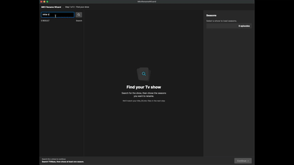

# mkv-rename-wizard
Is a cross platform desktop app built on [avalonia](https://avaloniaui.net/) desgined to help you rename TV Shows after you have ripped them using [MakeMKV](https://www.makemkv.com/).  This tool is intented to be used with the default naming schema from make mkv ie `title_t00.mkv`.

# How to Run
Clone this repo and run `dotnet run`.

# Credits
Thank you to the team over at [MakeMKV](https://www.makemkv.com/) for providing people with Media Preservation tools.

The backend api uses [TvMaze](https://www.tvmaze.com/) you can check their site to see if the show you have exists.  Thank you to the team for providing this api.
